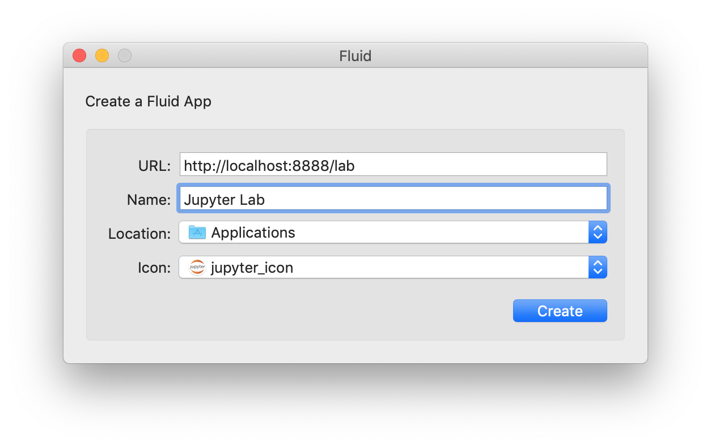

# 문제

# 해결

## 방법1: Fluid.app 
### (1) Download Fluid app
[Fluid app](https://fluidapp.com/)로 가서 Fluid app을 다운받는다.

### (2) create app with Fluid

URL, Name, Location, Icon을 그림과 같이 입력한다. icon은 [여기](../img/jupyter_icon.png)에서 다운로드 받는다.

### (3) Result


## 방법2: nativefier
### (1) Anaconda 설치
    생략
### (2) jupyter lab configure 파일 생성
```
jupyter-lab --generate-config
```
`~/.jupyter/jupyter_notebook_config.py`파일을 열고 `c.NotebookApp.token=''`로 비워준다. Desktop App을 만들면 실행시 token 입력 과정이 필요한데, 이를 생략하기 위한 절차이다.
### (3) Nativefier를 이용하여 Desktop Application 빌드
`nativefier`(웹 페이지를 브라우저에서 열지 않고 앱으로 생성해 주는 패키지)를 이용하여 Desktop App을 만든다.

```
# in case you didn't install node:
# conda install -c conda-forge nodejs

npm install nativefier -g
cd ~/Applications
nativefier "http://localhost:8888"
```

    이렇게 `nativefier`를 쳤을 때 command not found 에러가 뜬다면 `PATH` 설정을 해주어야 한다.
    나는 `.zshrc` 에 `export PATH=$PATH:/Users/donghee/.npm-global/bin`을 작성했다.
- [에러 참고](https://github.com/nativefier/nativefier/issues/896)
- [PATH 설정 참고](https://stackoverflow.com/questions/7703041/editing-path-variable-on-mac)


# 참고
- [Fluid app](https://fluidapp.com/)
- https://hoishing.medium.com/create-native-app-for-jupyter-in-macos-f239884b9fac
- [nativefier](https://github.com/nativefier/nativefier)
- https://sulmasulma.github.io/data/2019/10/17/jupyter-with-chrome-app.html
- https://gist.github.com/xiaolai/697ec3ea1607994440abf574c0f017e5

