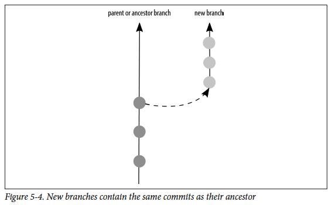

# Branches


버전 관리를 하기 위해 사용되는 브랜치는 다양한 방식으로 사용된다.

- 소프트웨어의 *다른 버전*들을 표시할 때도 브랜치를 사용할 수 있다. 
- *버그 수정*을 할 때라면 매우 잠깐 브랜치를 사용할 것이다.
- 새로운 아이디어를 *테스트*하려면 장기적인 브랜치를 사용할 것이다.


## 브랜치 목록 만들기

```bash
# Listing local branches
$ git branch --list

# List all branches
$ git branch --all
```

기본적으로 local repository에는 `master` 브랜치가 복사되고 이걸로 작업을 시작할 수 있다.


> \* master 
>
>    remotes/origin/master
>
>    remotes/origin/sandbox
>
>    remotes/origin/video-lessons

remote branch list를 살펴보면, 별(*)표시는 해당 브랜치가 현재 작업중 (또는 "checked out")이라는 뜻이다. 

그 밑에는 remotes/origin으로 시작되는데 remotes는 "not here(로컬이 아니다)"라는 뜻이다. origion은 "my copy is cloned from here"이라는 뜻이다. 그리고 master, sandbox, video-lessons는 모두 브랜치 이름이다.


```bash
# List remote branches
$ git branch --remotes
혹은 줄여서
$ git branch -r
```

사용할 수 있는 원격 브랜치의 이름 목록을 얻을 수 있다. 이 브랜치에 모두 접근할 수 있다. 다만 이 브렌치들에 수정사항(change)를 commit하려면 your own copy를 만들어야 한다.


## 원격 브랜치 목록 업데이트 하기

remote branch list는 자동으로 최신상태가 되지 않는다. 그때 그때 업데이트 해줘야한다. list를 업데이트하려면 `fetch` 명령어를 사용하면 된다.

```bash
$ git fetch
```

remote working에 대해서는 7장에서 자세히 다룬다.


## 다른 브랜치 사용하기

브랜치를 checkout하면 본인 시스템에 보이는 파일(working tree)이 repository에 저장되있는 버전으로 업데이트 된다. 새로만든 브랜치를 사용하여 어떤 작업을 수행하려면, 이 브랜치를 사용하겠다고 명시적으로 지정해주어야 한다. 이러한 업데이트는 `checkout` 명령어로 한다.

```bash
# Switching branches with the command checkout
$ git checkout --track origin/video-lessons
```

```bash
$ git checkout <branch>
```


`-b` 옵션을 설정해주면 remote repository인 origin에 저장된 video-lessons 브랜치로부터 video-lessons라는 이름의 새로운 local branch를 생성하여 추적하도록 한다(`--track`). 

```bash
$ git checkout --track -b video-lessons origion/video-lessons
```

이렇게 생성하고 아래의 명령어를 치면 브랜치 리스트가 다음과 같이 바뀐다.

```bash
$ git branch -a
```

>    master 
>
>   \* video-lessons
>
>    remotes/origin/master
>
>    remotes/origin/sandbox
>
>    remotes/origin/video-lessons


### 새 브런치 생성하기

혼자하는 개인 프로젝트라도, 아래의 질문에 yes라는 대답이 하나라도 나온다면 브랜치를 생성해야한다.

- Is it possible I will want to completely abandon this idea if things don’t work out?
- Am I creating something that is a significant deviation from the current published version of the software?
- Does my work need to undergo a review before it’s published or accepted into the published version of the software?
- Is it possible I will need to switch tasks before I’ve completed this work?


작업할 브랜치를 결정할 때는 issue tracker에서 시작하는 게 가장 좋다. 무엇을 할 것인가에 대한 설명을 작성하면 브랜치를 언제 시작하고 끝낼지가 명확해진다. 가장 무난한건 새로운 브랜치를 시작은 parent or ancestor branch의 가장 마지막 업데이트 일때가 좋다.




시작점으로 사용할 브랜치를 checkout하고 다음으로 새로운 브랜치를 생성한다. 마지막으로 새로운 브랜치를 checkout한다. 

```bash
# swithced to branch 'master'
$ git checkout master

# create new branch
$ git branch 1-process_notes

# Swiched to branch '1-process_notes'
$ git checkout 1-process_notes
```


### 수정사항을 저장소에 추가하기


### 태그 붙이기


### 원격 저장소와 연결하기


### 명령어 참조


## 참고

<Git for Teams> chatper 5

생활코딩 https://opentutorials.org/course/1492/8056

