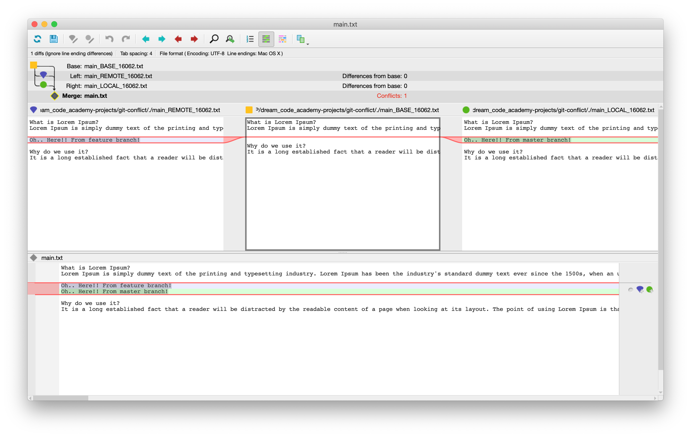

# 문제

git merge 에서 conflict가 발생한 경우, 이를 해결해야한다.

직접 수정하는 방법과 프로그램을 이용하는 방법이 있는데 이 노트에서는 프로그램을 이용한 방법을 소개한다.


# 해결

p4merge

https://www.perforce.com/downloads/visual-merge-tool

application을 다운로드 받는다.

p4merge.app 파일만 application 디렉토리에 복사한다.


```shell
$ git config --global merge.tool p4mergetool
$ git config --global mergetool.p4mergetool.cmd \
"/Applications/p4merge.app/Contents/Resources/launchp4merge \$PWD/\$BASE \$PWD/\$REMOTE \$PWD/\$LOCAL \$PWD/\$MERGED"
$ git config --global mergetool.p4mergetool.trustExitCode false
$ git config --global mergetool.keepBackup false
```


이제 아래 명령어를 치면 p4merge 프로그램 창이 뜬다

```shell
$ git mergetool
```


더 자세한 방법은 [이 곳](https://gist.github.com/tony4d/3454372)을 참고한다.


#### 주의

git 최신 버전의 경우 좀 더 쉽게 할 수 있다.


### 사용법



- 가운데 노란색: BASE라고 두 가지 branch의 변경사항이 없는 기본적인 화면
- 왼쪽 보라색: REMOTE 라고 merge하고자 하는 branch를 뜻함
- 오른쪽 초록색: LOCAL 라고 지금 작업하고 있는 branch를 뜻함

아래 화면에서 오른쪽에 보라색,초록색 버튼을 눌러서 어떤 변경사항을 고를지 선택할 수 있다.

[shift + 클릭] 하면 둘 다 선택할 수 있다.


# 참고

[Git 마스터 과정 (기본개념부터 실무팁까지)](https://academy.dream-coding.com/courses/git)

